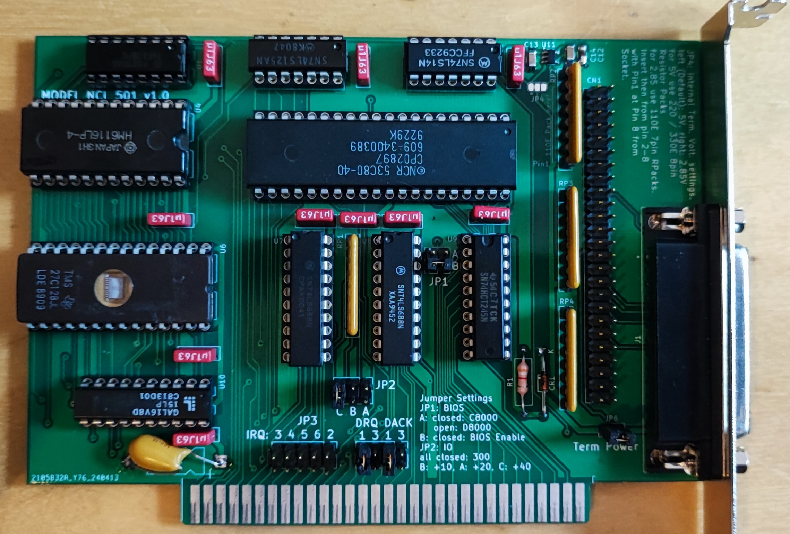

# NCL501-SCSI-8-Bit
Recreation of a bootable ISA 8-Bit SCSI Card.

There is one PAL on the Card (PAL16L8), it is protected unfortunately.
A dump has been done and the equations have been recreated.
They might be wrong.
BIOS EPROM is a 27C64 Type, RAM is not poplated but a 6116 might be used (24-pin Socket).

[Schematic](schematic/NCL501/pdf/NCL501.pdf)

The new card looks like this:

or the real thing:

Changes are:

* active termination or passive Termination possible.
* Term Power with Jumper
* DB25 Connector instead of DB37
* smaller (97.75 x 135mm)

For active Termination the following Parts are needed:

    - C12: 470p Footprint 1206

    - C13, C14: 100n Footprint 1206

    - U11: MIC5219 2.85V Regulator SOT-23-5

This Adapter has some serious shortcomings:

In my Computer (micro8088) it ONLY works with DRQ/DACK 3, ROM @ D8000 and IO @ 330!
IRQ doesn't matter also the RAM onboard is not necessary.

I tested the following Images:

Heads and Sectors working:

spf = sectors/fat, spc = sectors/cluster

* C:  79 / H:8  / S:32 10 MB (FAT12) works
* C:  95 / H:8  / S:32 12 MB (FAT12) works
* C:  39 / H:16 / S:32 10 MB works
* C:  22 / H:15 / S:63 10 MB doesn't work (non-system disk)
* C:  21 / H:16 / S:62 10 MB doesn't work (non-system disk)
* C:  21 / H:16 / S:63 10 MB doesn't work (non-system disk)
* C:  63 / H:16 / S:32 16 MB (FAT12) works
* C:  67 / H:16 / S:32 17 MB (FAT16/4) doesn't work (non-system disk)
* C:  67 / H:16 / S:32 17 MB (FAT16/4) with spf=0x40 instead of 0x100: works
* C: 127 / H:16 / S:32 32 MB (FAT16/4) with spf=0x40 instead of 0x100: works
* C: 135 / H:16 / S:32 33 MB (FAT16/6) with spf=0x60 instead of 0x100: works
* C: 255 / H:16 / S:32 64 MB (FAT16/6) with spf=0x40 instead of 0x100: doesn't work (non-system disk)
* C: 255 / H:16 / S:32 64 MB (FAT16/6) with spf=0x40 instead of 0x100: doesn't work (non-system disk)
* C: 255 / H:16 / S:32 64 MB (FAT16/6) with spf=0x80 instead of 0x100: works
* C: 507 / H:16 / S:32 127 MB (FAT16/6) with spf=0xFF instead of 0x100: doesn't work (non-system disk)
* C: 507 / H:16 / S:32 127 MB (FAT16/6) with spf=0xFE instead of 0x100: doesn't work (non-system disk)
* C: 359 / H:16 / S:32 90 MB (FAT16/6) with spf=0xC0 instead of 0x100, spc=4: doesn't work
* C: 359 / H:16 / S:32 90 MB (FAT16/6) with spf=0xC0 instead of 0x100, spc=8: doesn't work
* C: 183 / H:16 / S:63 90 MB (FAT16/6) with spf=0xC0 instead of 0x100: doesn't work (non-system disk)
* C: 359 / H:16 / S:32 90 MB (FAT16/6) with spf=0xD0 instead of 0x100: doesn't work, hangs
* C: 359 / H:16 / S:32 90 MB (FAT16/6) with spf=0xE0 instead of 0x100: doesn't work, hangs
* C: 479 / H:16 / S:32 120 MB (FAT16/6) with spf=0xF0 instead of 0x100: doesn't work (non-system disk)
* C: 511 / H:16 / S:32 128 MB (FAT16/6) with spf=0xC0 instead of 0x100: doesn't work
* C: 511 / H:16 / S:32 128 MB (FAT16/6) with spf=0x80, spc=8 instead of 0x100: works
* C: 515 / H:16 / S:32 129 MB (FAT16/6) with spf=0xC0 instead of 0x100: doesn't work
* C: 763 / H:16 / S:32 191 MB (FAT16/6) with spf=0xC0 instead of 0x100: doesn't work
* C: 767 / H:16 / S:32 192 MB (FAT16/6) with spf=0xC0 instead of 0x100: doesn't work
* C:1019 / H:16 / S:32 255 MB (FAT16/6) with spf=0x80,spc=16  works
* C:1023 / H:16 / S:32 256 MB (FAT16/6) with spf=0x80,spc=16  works
* C: 741 / H:16 / S:33 191 MB (FAT16/6) with spf=0xC0 instead of 0x100: doesn't work (non-system disk)
* C: 1006 / H:14 / S:48 330 MB (FAT16/6) with spf=0xC0 instead of 0x100: doesn't work (non-system disk)
* C:  510 / H:16 / S:48 191 MB (FAT16/6) with spf=0xC0 instead of 0x100: doesn't work (non-system disk)
* C:  620 / H:16 / S:62 300 MB (FAT16/6) with spf=0x100,spc=16: doesn't work (non-system disk)
* C:  620 / H:16 / S:62 300 MB (FAT16/6) with spf=0x80,spc=32: doesn't work (non-system disk)
* C:  620 / H:16 / S:62 300 MB (FAT16/6) with spf=0x80,spc=32: doesn't work (non-system disk)
* C:  262 / H:16 / S:63 300 MB (FAT16/6) with spf=0xFC,spc=16: doesn't work (non-system disk)
* C:  262 / H:16 / S:63 300 MB (FAT16/6) with spf=0xC0,spc=16: doesn't work (non-system disk)
* C:  514 / H:32 / S:32 257.5 MB (FAT16/6) with spf=0xFC,spc=16  works
* C: 1005 / H:32 / S:32 503 MB (FAT16/6) with spf=0xFC,spc=16  works
* C: 1001 / H:5 / S:52 127 MB (FAT16/6) with spf=0xC0,spc=8 doesn't work (non-system disk)
* C: 1001 / H:5 / S:52 127 MB (FAT16/6) with spf=0xFC,spc=8 doesn't work (non-system disk)
 
* C: 127 / H:16 / S:32 32 MB doesn't work (non-system disk)
* C: 479 / H:8  / S:32 60 MB doesn't work (non-system disk)
* C: 511 / H:8  / S:32 64 MB doesn't work (non-system disk)
* C: 197 / H:32 / S:32 99 MB (FAT16/4) with spf=0xC0 instead of 0x100: doesn't work (non-system disk)
* C:1023 / H:8  / S:32 128 MB doesn't work (non-system disk)
* C:1023 / H:16 / S:32 256 MB doesn't work (non-system disk)
* C:1019 / H:16 / S:32 255 MB doesn't work (non-system disk)
* C: 511 / H:16 / S:32 128 MB doesn't work (non-system disk)
* C: 511 / H:16 / S:32 128 MB (FAT16/4) with spf=0x40 instead of 0x100: doesn't work (non-system disk)
* C: 503 / H:16 / S:32 126 MB (FAT16/4) with spf=0x40 instead of 0x100: doesn't work (non-system disk)

Limits are: 

* spf Value only 8-bit and only some values are possible.
* Size 503MB for now.

The Card can be hacked to be a SUMO SCSI Card with reasonable effort.